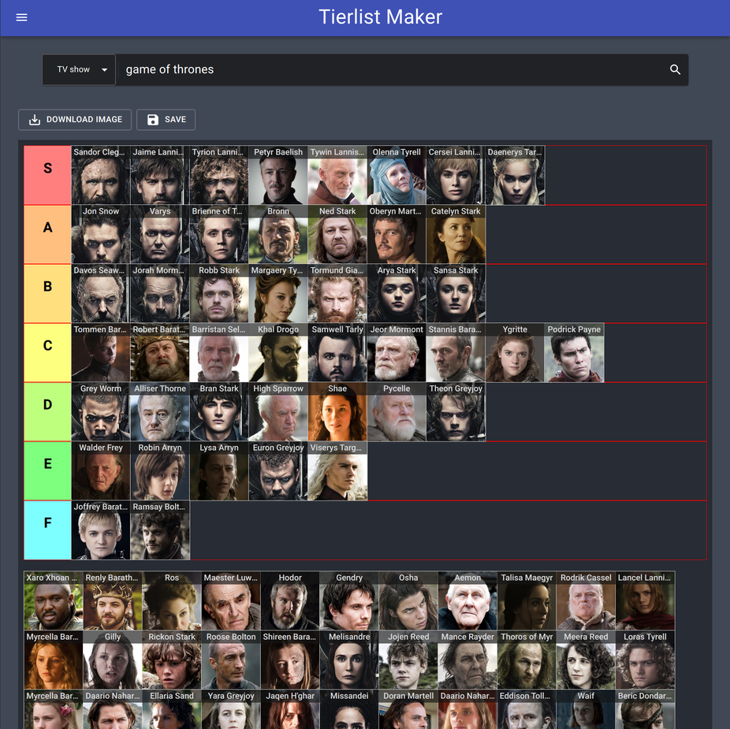

# Tierlist creator

Create a tierlist for your favourite tv shows, movies, anime or manga. More item types may be added if I can find public APIs for them.

[https://doodlehead.github.io/Tierlist/](https://doodlehead.github.io/Tierlist/)

## What's a tierlist?

Tierlists are just charts that help visualize the ranking of things.

For example, a quick Game of Thrones tierlist I made with my app. A character higher up vertically in the list means I like them more.

<small>P.S. the chart above only considers seasons 1-7. :wink: </small>

## Implementation details

- Built using Typescript and React + Vite
- Deployed using Vercel
- Component library: [material-ui](https://material-ui.com/)
- TV show and movie data fetched from [theTBDB's API](https://thetvdb.com/)
- Anime and manga data fetched from [Jikan's API](https://jikan.moe/)

## Stuff to fix

- Refactor `ListMaker` because it's getting big
- Manage/delete old localStorage data? Have a delete button?
- Paginate search results for TVDB API requests
- Have a "show more" option for Jikan API requests
- Take a look at some good open-source React projects for inspiration on proper application folder structure and organization
- Routing is done weird...

## Future changes

- Customizable tiers, add/remove and rename
- Customizable appearance of the list
- Fast tier assignment using right-click
- Custom images upload
- "Fork" a tierlist
- Use a state management library like Redux or MobX (if needed)
- Progressive Web App?
- Automated testing? (Cypress? Jest?)
- Use CI + CD?
